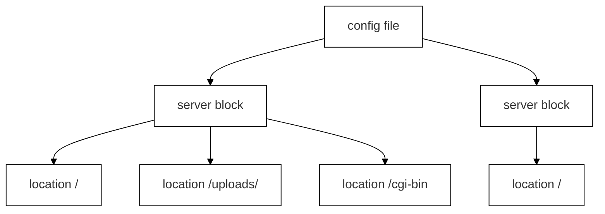

# Configuration Reference

The server is configured through a `.conf` file using an Nginx-inspired block syntax. The file is composed entirely of `server` blocks — there are no global directives outside them. Each server block represents an independent server context with its own rules.

Multiple server blocks can exist in the same file, as long as each defines a unique `host:port` combination. This allows the server to listen on different ports, serve different content, and apply different behaviours.

---

## Config Structure



Location matching uses longest-prefix matching — the most specific path wins.

---

## Server-Level Directives

These directives are set inside a `server { }` block and apply to the entire server context unless overridden at the location level.

---

### `listen`
**Required.** Defines the host and port the server listens on. Multiple `listen` directives are allowed per server block.

```nginx
listen 8080;
listen localhost:9090;
listen 127.0.0.1:8080;
```

- Port must be in range 1–65535.
- If only a port is given, the host defaults to `0.0.0.0` (all interfaces).
- Each `host:port` combination must be unique across the entire configuration file — duplicates are rejected at startup.

---

### `root`
**Required.** Sets the base directory from which files are served.

```nginx
root www/;
```

- Can be a relative or absolute path.
- Overridable at the location level.

---

### `server_name`
**Optional.** Associates one or more domain names with this server block.

```nginx
server_name example.com www.example.com;
```

Since each `host:port` combination is unique across server blocks, `server_name` is informational — it is not used for server selection logic.

---

### `methods`
**Optional.** Restricts the HTTP methods accepted by this server. If omitted, all methods are allowed.

```nginx
methods GET POST DELETE;
```

- Supported: `GET`, `POST`, `DELETE`.
- Overridable at the location level.

---

### `client_max_body_size`
**Optional.** Sets the maximum allowed size for a client request body. Requests exceeding this are rejected with `413 Payload Too Large`.

```nginx
client_max_body_size 10M;
```

- Units: `K`, `M`, `G`.
- Overridable at the location level.

---

### `error_page`
**Optional.** Maps one or more HTTP status codes to a custom error page. Multiple directives are allowed.

```nginx
error_page 404 www/html/errors/404.html;
error_page 403 404 405 www/html/errors/default.html;
```

- Codes must be in range 100–599.
- A single directive can handle multiple codes pointing to the same file.

---

## Location-Level Directives

These directives are set inside a `location /path { }` block and apply only to requests matching that path.

---

### `root`
**Optional.** Overrides the server-level root for this location.

```nginx
location /uploads/ {
    root www/uploads/;
}
```

---

### `methods`
**Optional.** Restricts HTTP methods for this location, overriding the server-level setting.

```nginx
location /uploads/ {
    methods GET POST DELETE;
}
```

---

### `autoindex`
**Optional.** Enables or disables automatic directory listing.

```nginx
location /public/ {
    autoindex on;
}
```

---

### `index`
**Optional.** Specifies the default file to serve when a directory is requested. Multiple filenames can be listed; the server tries each in order.

```nginx
location / {
    index index.html index.htm;
}
```

---

### `upload_dir`
**Optional.** Specifies the directory where uploaded files are stored (POST) and from which they can be deleted (DELETE).

```nginx
location /uploads/ {
    methods POST DELETE;
    upload_dir www/uploads/;
}
```

---

### `client_max_body_size`
**Optional.** Overrides the server-level body size limit for this location.

```nginx
location /post_body {
    methods POST;
    client_max_body_size 100M;
}
```

---

### `cgi_ext`
**Optional.** Maps a file extension to a CGI interpreter. Multiple directives are allowed in the same location.

```nginx
location /cgi-bin {
    methods GET POST;
    root /www/cgi-bin/;
    cgi_ext .py /usr/bin/python3;
    cgi_ext .bla ./cgi_tester;
}
```

- The extension must start with `.`.
- The interpreter must be an absolute or relative path to an executable.

---

### `return`
**Optional.** Immediately redirects the client to another URL.

```nginx
return 301 /new-path;
return 302 https://example.com/;
```

- Supported codes: `301` (permanent) and `302` (temporary).
- The URL sets the `Location` header in the response.

---

### `error_page`
**Optional.** Same as the server-level `error_page`, scoped to this location only.

```nginx
error_page 404 www/html/errors/not-found.html;
```

---

## Default Behaviour and Fallback

### No location blocks

A server block without any location blocks is fully functional. Requests are handled using the server-level configuration directly.

```nginx
server {
    listen 8080;
    root www/;
}
```

A request to `/index.html` resolves to `www/index.html`.

### No matching location

If a request URI does not match any location block, the server falls back to the server-level configuration.

---

## Method Resolution

The `methods` directive is optional and may be declared at both server level and location level.

- If defined at server level, it restricts allowed methods globally for that server context.
- A location block may override this by declaring its own `methods` directive.
- If no `methods` directive is declared anywhere, all HTTP methods are allowed by default.

```nginx
server {
    listen 8080;
    root www/;
    methods GET POST;

    location /api/delete-stuff {
        methods DELETE;
    }
}
```

In this example, requests to `/index.html` allow only `GET` and `POST`. Requests to `/api/delete-stuff` allow only `DELETE`.

---

## Full Configuration Example

```nginx
server {
    root www/;
    listen localhost:8080;
    server_name example.com;
    client_max_body_size 1M;

    error_page 404 www/html/errors/default.html;
    error_page 500 www/html/errors/default.html;

    location / {
        methods GET;
        index index.html;
    }

    location /post_body {
        methods POST;
        client_max_body_size 100M;
    }

    location /uploads/ {
        autoindex on;
        methods GET POST DELETE;
        root www/uploads/;
        upload_dir www/uploads/;
    }

    location /cgi-bin {
        methods GET POST;
        root /www/cgi-bin;
        cgi_ext .py /usr/bin/python3;
    }

    location /old-page {
        return 301 /new-page;
    }
}
```