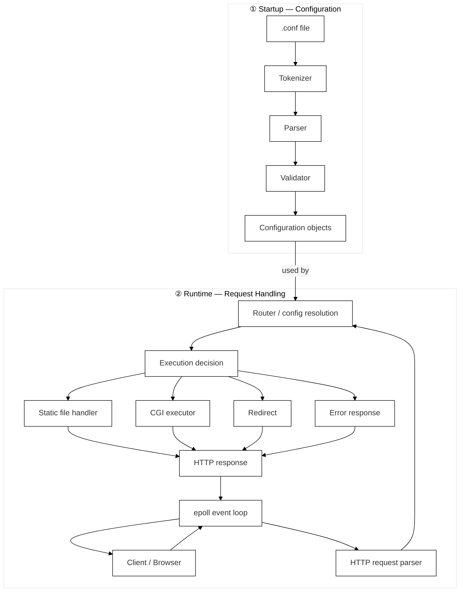

# Developer Documentation

## Architecture Overview

Webserv is a single-threaded, non-blocking HTTP server written in C++98.

The server is built around an event-driven architecture. Client connections, reads, writes, and CGI pipe communication are handled through Linux `epoll`, without spawning one thread or process per client connection.

The only exception is CGI execution, where the server forks a child process to run the configured CGI interpreter.

The project is divided into several main responsibilities:

- **Configuration system**: reads, parses, validates, and stores the `.conf` file.
- **Network/event layer**: manages sockets and file descriptors through `epoll`.
- **HTTP layer**: parses requests and builds responses.
- **Routing layer**: selects the correct server/location configuration for each request.
- **Execution layer**: serves static files, handles redirects, uploads, directory listing, errors, and CGI.

---

## Global Flow



At startup, the configuration file is read once and converted into internal objects. During runtime, the router uses those objects to decide how each request should be handled.

---

## Event Loop

The core of the server is an `epoll` loop that monitors all active file descriptors and dispatches events accordingly.

The server uses `epoll_wait()` as the central blocking point of the program. Socket I/O is only performed after readiness has been reported by `epoll`.

This keeps the server non-blocking and allows one process to handle multiple clients concurrently.

---

## Configuration System

The configuration system is responsible for turning a text `.conf` file into validated internal configuration objects.

It defines the server's behaviour, not its mechanics. It does not handle network communication or parse raw HTTP requests — it defines the rules and policies that determine how the server responds to them.

Once HTTP parsing is complete, the configuration layer receives:

- Local host/port that accepted the connection
- Request method
- Request URI
- Request body (if any)

Given those inputs, it determines:

- Which `server` block applies
- Which `location` block matches the URI
- Whether the HTTP method is allowed
- Which root directory to use
- Whether autoindex is enabled
- Whether to apply a redirect
- Whether to trigger CGI
- Whether the body exceeds `client_max_body_size`

It is split into three main phases:

**Tokenization**
The raw file is broken into four token types: `WORD` (any sequence of non-whitespace, non-symbol characters), `LBRACE` (`{`), `RBRACE` (`}`), and `SEMICOLON` (`;`). Comments beginning with `#` and all whitespace are ignored. The tokenizer is intentionally simple — it does not classify words as numbers, paths, or methods. All semantic interpretation happens during parsing. Each token stores its line number for precise error reporting.

**Parsing**
The parser consumes the token stream and builds structured objects such as server blocks and location blocks. It uses a recursive descent approach that maps directly to the grammar rules.

**Validation**
The validator checks that the resulting configuration is usable. This includes:

- At least one `server` block must exist
- Each `server` block must contain at least one `listen` directive
- No duplicate `host:port` combinations across server blocks
- Location paths must start with `/`
- Ports must be integers between `1` and `65535`
- `client_max_body_size` must be a valid numeric format
- `error_page` codes must be valid integers
- `cgi_ext` extensions must start with `.`
- `return` codes must be `301` or `302`
- Unknown directives cause immediate failure

The system fails early and clearly rather than allowing partially valid configurations that could cause undefined behaviour at runtime. If parsing fails, the server exits with error code `1` and reports the exact line number of the problem.

The server does not reread the text configuration file during request handling. Once startup succeeds, the runtime code only uses the validated configuration objects.

For the full formal grammar in EBNF notation, see [GRAMMAR.md](GRAMMAR.md).

---

## Configuration Model

The configuration model follows a simple hierarchy:

```
Configuration
└── ServerConfig
    ├── listen directives
    ├── server_name values
    ├── root
    ├── methods
    ├── error pages
    ├── client_max_body_size
    └── LocationConfig[]
        ├── path
        ├── root
        ├── methods
        ├── index
        ├── autoindex
        ├── upload_dir
        ├── redirect
        └── CGI extension mapping
```

A server block defines the default behaviour for one configured server context. A location block defines behaviour for a specific URI prefix and may override some server-level rules.

---

## Routing Logic

When a complete HTTP request is available, the routing layer decides how it should be handled.

The routing process follows these steps:

1. **Select the server block** — match the local `host:port` pair that accepted the connection. Since duplicate `host:port` combinations are rejected during configuration validation, `server_name` is informational and is not required for server selection.
2. **Select the location block** — compare the request URI against the configured locations and select the one with the longest matching prefix.
3. **Handle redirects** — if the matched location defines a redirect, prepare a redirect response decision.
4. **Validate the method** — check the request method against the matched location or server method rules. Return `405 Method Not Allowed` if the method is not permitted.
5. **Resolve the filesystem path** — map the request URI to a file path using the matched location root, and validate that it does not escape the configured root.
6. **Choose the execution path** — serve a static file, serve an index file, generate an autoindex page, execute CGI, or return an error response.

The router does not directly send the response. Its job is to produce a clear execution decision for the rest of the server.

---

## Static File Serving

For non-CGI requests, the server resolves the requested resource to a file on disk.

The usual flow is:

1. Resolve the file path from the matched route.
2. Check whether the file exists.
3. Check whether the file can be accessed.
4. If the path is a directory, try the configured `index` file.
5. If no index exists and `autoindex` is enabled, generate a directory listing.
6. Build an HTTP response with the file contents and appropriate headers.

Common response codes:

- `200 OK` — file served successfully
- `403 Forbidden` — access denied
- `404 Not Found` — resource does not exist
- `405 Method Not Allowed` — method not accepted
- `413 Payload Too Large` — request body exceeds the configured limit
- `500 Internal Server Error` — unexpected server-side failure

---

## CGI Execution

CGI is used when the resolved request path matches a configured CGI extension, such as `.py`.

CGI execution requires a separate child process because the server must run an external interpreter or script.

Before calling `execve`, the child process prepares the CGI environment. Typical variables include:

```txt
REQUEST_METHOD
SCRIPT_FILENAME
SCRIPT_NAME
QUERY_STRING
CONTENT_LENGTH
CONTENT_TYPE
SERVER_PROTOCOL
PATH_INFO
```

The parent process keeps the event loop running and reads CGI output through pipe file descriptors.

This keeps CGI execution isolated from the main server flow: the child process runs the external program, while the parent process collects the output and turns it into an HTTP response.

---

## Request Lifecycle

A typical request follows this path:

```
client connects
→ epoll reports readable socket
→ server reads request bytes
→ HTTP parser builds HttpRequest
→ router matches server/location
→ server builds execution decision
→ static/CGI/error/redirect handler builds HttpResponse
→ epoll reports writable socket
→ server sends response
→ connection is closed or reused depending on the server's connection handling support
```

---

## Error Handling

The server should never crash because of malformed client input.

Invalid requests or runtime failures are converted into HTTP error responses whenever possible. The server maps standard HTTP status codes to their appropriate error conditions — covering bad syntax, missing resources, permission failures, oversized bodies, and server-side failures.

If a configured custom error page exists for the returned status code, it is served instead of the default generated error body.

---

## Design Decisions

### Why epoll over select/poll?

`epoll` is efficient for monitoring many file descriptors. Unlike `select` or `poll`, it does not require scanning the entire descriptor set on every event loop iteration. This makes it a good fit for an event-driven HTTP server.

### Why single-threaded?

A single-threaded design avoids locking, shared-memory synchronisation, and race conditions between worker threads. Concurrency is handled through non-blocking I/O and the event loop. This is enough for the scope of the project and keeps the architecture easier to reason about.

### Why parse the configuration only once?

The configuration file is read and validated at startup. This means invalid configuration fails early, request handling is faster, runtime behaviour is predictable, and the router works with structured objects instead of raw text.

### Why longest-prefix location matching?

Longest-prefix matching gives predictable route selection. For example:

```nginx
location /images {
    root www/images;
}

location /images/icons {
    root www/icons;
}
```

A request for `/images/icons/logo.png` matches `/images/icons`, because it is more specific than `/images`.

### Why C++98?

C++98 is required by the project. This constraint forces careful memory management, explicit ownership decisions, and disciplined use of the standard library.

---

## Debugging Tips

### Use curl with headers
```bash
curl -i http://localhost:8080/
```

### Verbose curl output
```bash
curl -v http://localhost:8080/
```

### Send a custom Host header
```bash
curl -H "Host: example.com" http://localhost:8080/
```

### Test a POST body
```bash
curl -X POST http://localhost:8080/upload -d "hello"
```

### Test DELETE
```bash
curl -X DELETE http://localhost:8080/uploads/file.txt
```

### Check open ports
```bash
lsof -i :8080
```

### Check memory
```bash
valgrind ./webserv config/default.conf
```

---

## Development Notes

When modifying the server, keep responsibilities separated:

- The event loop should manage file descriptor readiness.
- The HTTP parser should only parse HTTP data.
- The router should only decide what should happen.
- Response builders should generate valid HTTP responses.
- CGI code should stay isolated from static file handling.

This separation makes bugs easier to locate and prevents one part of the server from becoming responsible for everything.

---

## Resources

- [Nginx documentation](https://nginx.org/en/docs/) — reference for configuration syntax and server behaviour
- [RFC 7230](https://www.rfc-editor.org/rfc/rfc7230) — HTTP/1.1 message syntax and routing
- [RFC 7231](https://www.rfc-editor.org/rfc/rfc7231) — HTTP/1.1 semantics and content
- [RFC 3875](https://www.rfc-editor.org/rfc/rfc3875) — CGI/1.1 specification