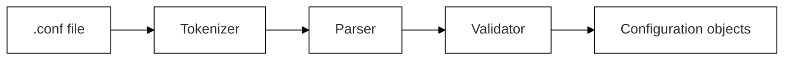
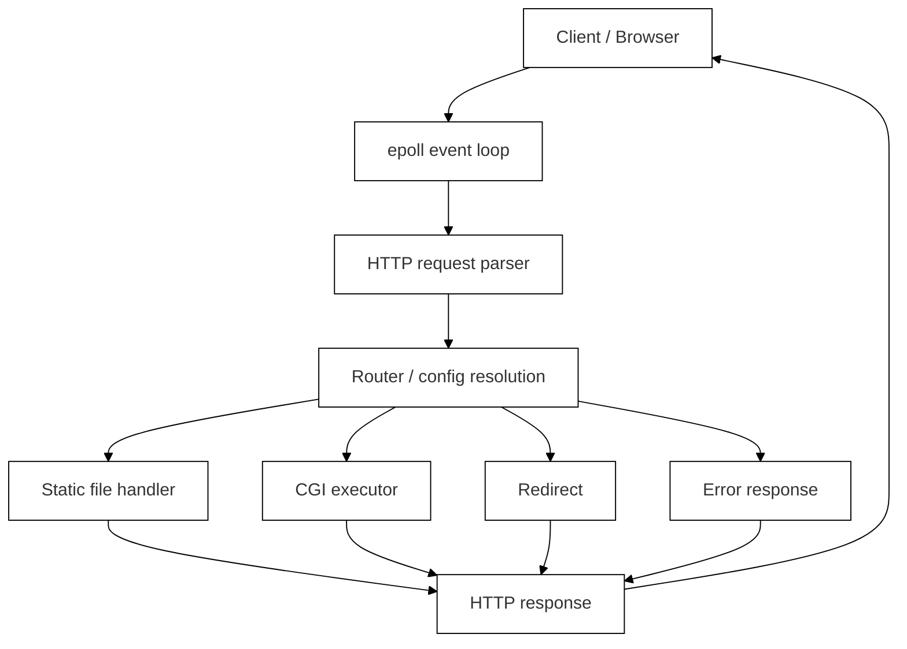

# Webserv

*Built as part of the 42 curriculum in collaboration with [ddias-fe](https://github.com/ddias-fe) and [mmiguelo](https://github.com/mmiguelo). My contributions focused on the configuration parser and routing logic.*

---

## Documentation

- **[What is this project?](#overview)** — Read on below for a high-level summary
- **[User Documentation](documentation/USER_DOC.md)** — How to build, configure, and run the server
- **[Developer Documentation](documentation/DEV_DOC.md)** — Architecture decisions, event loop, CGI internals
- **[Configuration Reference](documentation/CONFIG.md)** — Supported directives and example configurations
- **[Configuration Grammar](documentation/GRAMMAR.md)** — Formal syntax and validation rules

---

## Quick Start (TL;DR)

1. **Clone and build**
```bash
git clone <repo-url>
cd Webserv
make
```

2. **Run with a config file**
```bash
./webserv config/default.conf
```

3. **Test it**
```bash
curl http://localhost:8080/
```

---

## Overview

Webserv is a lightweight HTTP/1.1 web server written in C++98, built from scratch as part of the 42 curriculum. The goal is to understand how web servers actually work by implementing one — from raw socket handling to request parsing, routing, response generation, and CGI execution.

The server uses a non-blocking, event-driven architecture via Linux's `epoll`, handling multiple simultaneous client connections without spawning threads or processes per connection.

---

## How It Works

**① Startup — Configuration**



**② Runtime — Request Handling**



---

## Key Capabilities

- HTTP/1.1 request parsing and response generation
- Non-blocking I/O with `epoll`
- GET, POST, and DELETE method support
- Static file serving with MIME type detection
- Configurable routing via an Nginx-inspired `.conf` syntax
- CGI execution for Python scripts and custom binaries
- File uploads and deletion
- Directory listing with `autoindex`
- Custom error pages and HTTP redirects
- Multiple server contexts on different host/port combinations

---

## Project Structure

```
Webserv/
├── Makefile
├── README.md
├── config/
│   └── default.conf
├── www/
│   ├── html/
│   └── cgi-bin/
└── src/
    ├── config/
    ├── server/
    ├── request/
    ├── response/
    └── cgi/
```